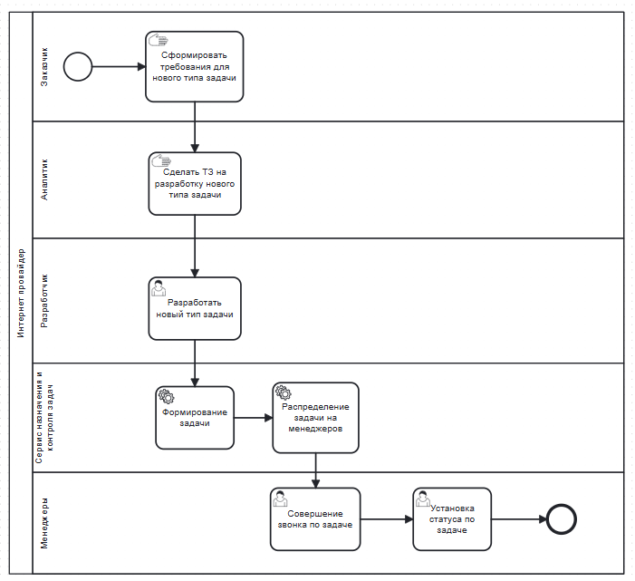
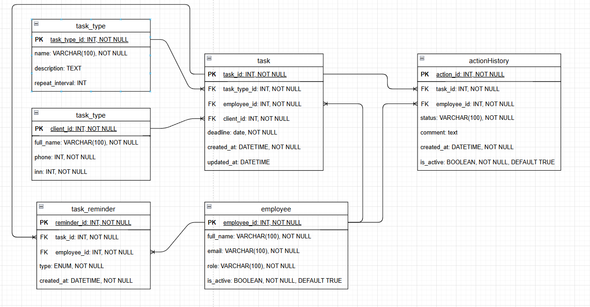
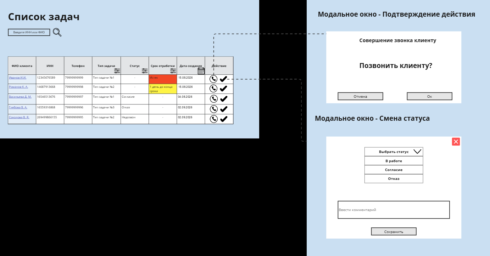

# Техническое задание: сервис назначения задач менеджерам (CRM)

> **Пет-проект.** Техническое задание на разработку интерфейса и логики работы с клиентскими задачами менеджеров отдела продаж: бизнес-цели с измеримыми критериями, Use Cases, функциональные требования, BPMN-диаграмма процесса, модель данных, алгоритм автоматических напоминаний и макет интерфейса.
>
> **Стек:** системный и бизнес-анализ, Use Cases, функциональные требования, BPMN 2.0, ER-моделирование, проектирование UI

---

## Содержание

1. [Общая информация](#1-общая-информация)
2. [Введение](#2-введение)
3. [Описание текущей ситуации](#3-описание-текущей-ситуации)
4. [Бизнес-цели](#4-бизнес-цели)
5. [Функциональные требования](#5-функциональные-требования)
6. [BPMN-диаграмма](#6-bpmn-диаграмма)
7. [Описание бизнес-логики (Backend)](#7-описание-бизнес-логики-backend)
8. [UI-логика (Frontend)](#8-ui-логика-frontend)

---

## 1. Общая информация

| Параметр | Значение |
|---|---|
| **Название документа** | Техническое задание на разработку интерфейса и логики работы с задачами менеджеров |
| **Название проекта** | Сервис назначения задач менеджерам |
| **Дата** | 07.09.2026 |
| **Автор** | Родичева А.О., аналитик |
| **Версия документа** | v0.1 — черновик |

---

## 2. Введение

**Цель документа.** Документ подготовлен для описания требований к разработке сервиса, который позволяет менеджерам просматривать и отрабатывать задачи. Цель — повысить прозрачность, автоматизировать назначения, улучшить контроль выполнения и заменить работу с Excel-файлами.

**Область применения.** Сервис будет использоваться в отделах продаж и обслуживания клиентов. Он предназначен для менеджеров, которые работают с клиентскими задачами. Также сервис используется руководителями для контроля прогресса выполнения задач.

**Термины и сокращения:**

| Термин / сокращение | Описание |
|---|---|
| ИНН | Идентификационный номер налогоплательщика. Используется для уникальной идентификации клиента. |
| Тип задачи | Логика, по которой формируются задачи. Например: «Подключил интернет, но не купил доп. продукты». |
| Статус задачи | Текущее состояние задачи: Согласие, Отказ, Недозвон. |

---

## 3. Описание текущей ситуации

На момент составления документа система назначения задач не реализована. Процесс построен вручную:

* Заказчики формулируют требования по формированию задач, а разработчики подготавливают SQL-запросы, по которым выгружается список клиентов.
* Этот список передается менеджерам в виде Excel-файлов, обычно через e-mail или мессенджеры.
* В таблице содержатся: ФИО клиента, ИНН, телефон и цель прозвона.
* Менеджеры вручную прозванивают клиентов и самостоятельно ведут пометки в файле или в отдельных документах.
* Контроль выполнения отсутствует, история взаимодействий не сохраняется, нет централизованного хранения данных.
* Повторное формирование задач и напоминания не автоматизированы.

---

## 4. Бизнес-цели

**Верхнеуровневая бизнес-цель:**

* **БЦ №1.** Повысить эффективность отработки клиентских задач менеджерами на 40% за 6 месяцев за счет автоматизации процесса назначения и контроля задач.

**Бизнес-цели с критериями успеха:**

| № | Критерий успеха |
|---|---|
| БЦ №1.1 | Не менее 90% задач должны быть взяты в работу в течение одного рабочего дня с момента назначения. |
| БЦ №1.2 | Не менее 75% задач, по которым менеджер установил контакт с клиентом, должны быть закрыты в течение 3 рабочих дней. |
| БЦ №1.3 | Количество просроченных задач должно снижаться не менее чем на 20% ежемесячно в течение первых трех месяцев после внедрения системы. |

---

## 5. Функциональные требования

### 5.1. Формирование и отображение таблицы «Список задач»

#### Use Case 1.1 — Просмотр таблицы задач

| Параметр | Значение |
|---|---|
| **Основные акторы** | Менеджер по продажам, Руководитель |
| **Система** | CRM-система |
| **Предусловия** | Пользователь авторизован в системе. В системе есть хотя бы одна задача. |

**Основной поток:**
1. Пользователь открывает раздел «Список задач».
2. Система формирует таблицу с задачами из БД.
3. Система отображает таблицу в интерфейсе с колонками: ФИО клиента, ИНН, Телефон, Назначенный менеджер, Тип задачи, Статус, Маркер срока отработки задачи, Дата создания.
4. Система отображает первые 30 задач. По умолчанию установлена сортировка по дате создания (по убыванию).

**Альтернативные потоки:**
* *Альтернатива 1.* Если задач нет — система отображает сообщение «Нет данных для отображения».

**Исключения:**
* *Ошибка 1.* Система недоступна из-за технической ошибки — система выводит сообщение «Не удалось загрузить данные» и кнопку «Повторить».

#### Use Case 1.2 — Сортировка таблицы задач

| Параметр | Значение |
|---|---|
| **Основные акторы** | Менеджер по продажам, Руководитель |
| **Система** | CRM-система |
| **Предусловия** | Выполнены шаги основного потока UC 1.1 (таблица загружена). |

**Основной поток:**
1. Пользователь кликает на заголовок колонки «Дата создания».
2. Система сортирует записи по дате: первый клик — по возрастанию, повторный — по убыванию.
3. Сортировка применяется к отображаемым данным.

**Исключения:**
* *Ошибка 1.* Система недоступна из-за технической ошибки — система выводит сообщение «Не удалось загрузить данные» и кнопку «Повторить».

#### Use Case 1.3 — Фильтрация таблицы задач

| Параметр | Значение |
|---|---|
| **Основные акторы** | Менеджер по продажам, Руководитель |
| **Система** | CRM-система |
| **Предусловия** | Выполнены шаги основного потока UC 1.1 (таблица загружена). |

**Основной поток:**
1. Система отображает доступные фильтры по полям: Тип задачи, Статус, Назначенный менеджер, Срок отработки, Дата создания.
2. Пользователь нажимает на нужное поле.
3. Система выводит список значений выбранного поля.
4. Пользователь выбирает значение в выпадающем списке фильтра.
5. Система применяет фильтр и отображает только задачи, соответствующие выбранному значению.

**Альтернативные потоки:**
* *Альтернатива 1.* Пользователь использует фильтр по дате — система предоставляет возможность выбрать начальную (от) и конечную (до) дату.
* *Альтернатива 2.* Пользователь сбросил фильтр — система отображает исходное состояние таблицы.
* *Альтернатива 3.* По фильтру не найдено ни одной записи — система отображает сообщение «Нет данных для отображения».
* *Альтернатива 4.* Пользователь применил более одного фильтра — система применяет фильтрацию по всем выбранным параметрам.

**Исключения:**
* *Ошибка 1.* Система недоступна из-за технической ошибки — система выводит сообщение «Не удалось загрузить данные» и кнопку «Повторить».

**Функциональные требования:**

| ID | Требование |
|---|---|
| FR-01 | Система должна отображать таблицу задач с колонками: ФИО клиента, ИНН, Телефон, Тип задачи, Назначенный менеджер, Статус, Маркер срока отработки, Дата создания. |
| FR-02 | Таблица должна поддерживать сортировку по дате создания. |
| FR-03 | Таблица должна поддерживать фильтрацию по типу задачи, назначенному менеджеру, статусу, маркеру срока отработки и дате создания. Для фильтра по дате система предоставляет возможность выбрать начальную (от) и конечную (до) дату. Система позволяет установить более одного фильтра. |
| FR-04 | При отсутствии данных должна выводиться заглушка «Нет данных для отображения». |
| FR-05 | При ошибке загрузки таблицы должно отображаться сообщение «Не удалось загрузить данные» и кнопка повторной загрузки. |

### 5.2. Поиск задач по ИНН и телефону

#### Use Case 1.4 — Поиск задач по ИНН или телефону

| Параметр | Значение |
|---|---|
| **Основные акторы** | Менеджер по продажам, Руководитель |
| **Система** | CRM-система |
| **Предусловия** | Пользователь авторизован в системе. В системе есть хотя бы одна задача. Пользователь находится в разделе «Список задач». |

**Основной поток:**
1. Пользователь вводит ИНН или номер телефона в строку поиска.
2. Система выполняет валидацию введенного значения: для ИНН — не более 12 знаков, только цифры; для телефона — не более 11 знаков, только цифры.
3. Система выполняет запрос в БД: если введен ИНН — поиск по полю «ИНН», если телефон — по полю «Телефон».
4. Система отображает только задачи с точным совпадением.

**Альтернативные потоки:**
* *Альтернатива 1.* Пользователь очищает строку поиска и нажимает Enter — система отображает исходное состояние таблицы (все записи).
* *Альтернатива 2.* По запросу не найдено ни одной записи — система отображает сообщение «Нет данных для отображения».
* *Альтернатива 3.* Формат ИНН/телефона некорректен — система отображает сообщение «Введите корректное значение ИНН или телефона».

**Исключения:**
* *Ошибка 1.* Система недоступна из-за технической ошибки — система выводит сообщение «Не удалось загрузить данные» и кнопку «Повторить».

**Функциональные требования:**

| ID | Требование |
|---|---|
| FR-06 | Система должна поддерживать поиск задачи по полю ИНН. |
| FR-07 | Система должна поддерживать поиск задачи по номеру телефона. |
| FR-08 | Поиск должен срабатывать при точном совпадении значений. |
| FR-09 | Система выполняет валидацию введенного ИНН и телефона: для ИНН — не более 12 знаков, только цифры; для телефона — не более 11 знаков, только цифры. |
| FR-10 | При отсутствии результатов должно отображаться сообщение «Нет данных для отображения». |
| FR-11 | При некорректном формате данных система должна выводить сообщение «Введите корректное значение ИНН или телефона». |
| FR-12 | После очистки строки поиска и нажатия Enter таблица возвращается к полному списку. |
| FR-13 | При ошибке загрузки таблицы должно отображаться сообщение «Не удалось загрузить данные» и кнопка повторной загрузки. |

### 5.3. Звонок клиенту

#### Use Case 1.5 — Совершение звонка клиенту из интерфейса задач

| Параметр | Значение |
|---|---|
| **Основной актор** | Менеджер по продажам |
| **Система** | CRM-система |
| **Предусловия** | Менеджер авторизован в системе. В таблице задач загружены данные. У задачи указан номер телефона. Интеграция с системой телефонии активна. |

**Основной поток:**
1. Менеджер находит нужную задачу в списке.
2. Нажимает на иконку «Позвонить» в строке задачи.
3. Система открывает модальное окно с подтверждением и кнопкой «Начать звонок».
4. Пользователь нажимает кнопку «Начать звонок».
5. Система инициирует звонок через встроенную телефонию.

**Альтернативные потоки:**
* *Альтернатива 1.* Пользователь нажимает «Отмена» в модальном окне — звонок не осуществляется.
* *Альтернатива 2.* Пользователь закрывает модальное окно без совершения звонка — ничего не происходит.

**Исключения:**
* *Ошибка 1.* Ошибка связи — система выводит сообщение «Ошибка при попытке соединения. Повторите позже».

**Функциональные требования:**

| ID | Требование |
|---|---|
| FR-14 | Система должна отображать иконку «Позвонить» в каждой строке задачи, если указан номер телефона. |
| FR-15 | При нажатии на иконку должна открываться модальная форма с подтверждением действия. |
| FR-16 | Система должна инициировать звонок при подтверждении пользователем. |
| FR-17 | При ошибке соединения должно выводиться сообщение об ошибке. |

### 5.4. Смена статуса задачи и добавление комментария

#### Use Case 1.6 — Изменение статуса задачи

| Параметр | Значение |
|---|---|
| **Основной актор** | Менеджер по продажам |
| **Система** | CRM-система |
| **Предусловия** | Пользователь авторизован в системе. Задача зарегистрирована в системе. Пользователь находится в списке задач. |

**Основной поток:**
1. Пользователь нажимает кнопку «Сменить статус».
2. Система отображает выпадающий список статусов: В работе, Отказ, Согласие, Продажа.
3. Пользователь выбирает нужный статус и при необходимости вводит комментарий.
4. Пользователь нажимает кнопку «Сохранить».
5. Система сохраняет новый статус и обновляет данные задачи.

**Альтернативные потоки:**
* *Альтернатива 1.* Менеджер отменяет изменение статуса — система сохраняет текущий статус задачи без изменений.
* *Альтернатива 2.* Статус не выбран — система не дает сохранить изменения и подсвечивает поле выбора.

**Исключения:**
* *Ошибка 1.* Система недоступна из-за технической ошибки — система выводит сообщение «Не удалось выполнить смену статуса».

**Функциональные требования:**

| ID | Требование |
|---|---|
| FR-18 | Система должна позволять менеджеру вручную изменить статус задачи из списка задач. |
| FR-19 | Доступные для выбора статусы: В работе, Отказ, Согласие, Продажа. |
| FR-20 | Если статус не выбран, кнопка «Сохранить» должна быть недоступна. |
| FR-21 | При системной ошибке смены статуса должно отображаться сообщение «Не удалось выполнить смену статуса». |

---

## 6. BPMN-диаграмма

**Процесс назначения задачи:**

---

## 7. Описание бизнес-логики (Backend)

### 7.1. Модель данных

#### 1. `task` — задача, назначенная менеджеру
Хранит конкретные задачи, которые необходимо отработать.

| Поле | Тип | Описание |
|---|---|---|
| `task_id` | int | Уникальный идентификатор задачи |
| `task_type_id` | int | Тип задачи (см. таблицу `task_type`) |
| `employee_id` | int | Менеджер, которому назначена задача |
| `client_id` | int | Клиент, по которому создана задача |
| `deadline` | date | Срок отработки задачи |
| `created_at` | datetime | Дата и время создания задачи |
| `updated_at` | datetime | Дата последнего изменения |

#### 2. `task_type` — справочник типов задач
Хранит шаблоны и описания логики формирования задач.

| Поле | Тип | Описание |
|---|---|---|
| `task_type_id` | int | Уникальный ID типа задачи |
| `name` | varchar | Название типа задачи |
| `description` | text | Описание / логика формирования |
| `repeat_interval` | int | Интервал повторения (в днях), если задача повторяющаяся |

#### 3. `client` — клиент
Информация о клиентах, по которым создаются задачи.

| Поле | Тип | Описание |
|---|---|---|
| `client_id` | int | Уникальный ID клиента |
| `full_name` | varchar | ФИО клиента |
| `phone` | int | Телефон |
| `inn` | int | ИНН |
| `city` | varchar | Город, в котором находится клиент |
| `date_from` | date | Дата заведения клиента |
| `date_close` | date | Дата отключения клиента |

#### 4. `employee` — менеджер
Информация о сотрудниках, на которых назначаются задачи.

| Поле | Тип | Описание |
|---|---|---|
| `employee_id` | int | Уникальный ID сотрудника |
| `full_name` | varchar | ФИО менеджера |
| `email` | varchar | Электронная почта |
| `role` | varchar | Роль (менеджер / руководитель и т.д.) |
| `city` | varchar | Город, в котором находится менеджер |
| `is_active` | boolean | Активен ли сотрудник (работает ли сейчас) |

#### 5. `action_history` — история работы с задачей
Хранит данные в историческом виде для отображения истории смены статусов.

| Поле | Тип | Описание |
|---|---|---|
| `action_id` | int | Уникальный идентификатор действия |
| `task_id` | int | Задача, к которой относится действие |
| `employee_id` | int | Сотрудник, выполнивший действие |
| `status` | varchar | Выбранный статус: В работе / Согласие / Отказ / Продажа |
| `comment` | text | Текст комментария |
| `created_at` | datetime | Время действия |
| `is_active` | boolean | Актуальность записи (проставляется для самой последней записи по задаче) |

#### 6. `task_reminder` — напоминания по просроченным задачам
Фиксирует факт отправки уведомления по задаче.

| Поле | Тип | Описание |
|---|---|---|
| `reminder_id` | int | Уникальный ID напоминания |
| `task_id` | int | Задача, по которой отправлено уведомление |
| `employee_id` | int | Менеджер, которому направлено уведомление |
| `type` | enum | Тип: «Задача не взята в работу», «Истекает срок» и т.д. |
| `created_at` | datetime | Время отправки |

### 7.2. Алгоритмы

#### Отправка уведомления на почту о задачах, не взятых в работу

**Назначение.** Система должна автоматически отслеживать задачи, по которым нарушены контрольные сроки, и отправлять менеджерам напоминания по электронной почте. Это повышает дисциплину обработки задач и снижает количество просрочек.

**Источники данных:**
* `task` — задачи;
* `employee` — менеджеры;
* `action_history` — определение актуального статуса задачи;
* `task_reminder` — фиксация факта отправки напоминаний (во избежание дублирующих писем).

**Логика реализации:**
1. **Плановое задание.** Система ежедневно в рабочие дни в 9:00 по московскому времени запускает алгоритм для задач без статуса.
2. **Поиск задач, не взятых в работу.** Найти задачи, которые:
   * созданы более 1 рабочего дня назад (`task.created_at`);
   * не имеют ни одной записи в `action_history` с `is_active = true`;
   * не имеют уведомления этого типа в `task_reminder` (`task_reminder.type = 'Задача не взята в работу'`).
3. **Создание записи в `task_reminder`.** Создать запись с `task_id`, `employee_id`, типом напоминания `type` и `created_at` (текущие дата и время).
4. **Отправка письма менеджеру.** Отправить шаблон письма №1 на электронную почту менеджера (`employee.email`).

**Шаблон письма №1 (задачи, не взятые в работу):**

| Элемент | Шаблон |
|---|---|
| Тема письма | `{task_reminder.type} по задаче: {task_type.name}, по клиенту: {client.inn}` |
| Тело письма | `Необходимо связаться с клиентом по задаче: {client.phone}, {client.full_name}, {client.inn}` |

**Пример письма:**
> **Тема:** Задача не взята в работу по задаче: Клиенты с технической поддержки, по клиенту: 77733377711
>
> **Тело:** Необходимо связаться с клиентом по задаче: 89999999999, Иван Иванов, 77733377711

---

## 8. UI-логика (Frontend)

**Макет интерфейса «Список задач»** с модальными окнами подтверждения звонка и смены статуса:

**Пример данных в таблице «Список задач»:**

| ФИО клиента | ИНН | Телефон | Тип задачи | Статус | Срок отработки | Дата создания |
|---|---|---|---|---|---|---|
| Иванов И. И. | 12345676589 | 79999999999 | Тип задачи №1 | — | 🟥 Истек | 15.08.2026 |
| Романов К. А. | 14687913668 | 79999999998 | Тип задачи №2 | — | 🟨 1 день до конца срока | 15.08.2026 |
| Васильева Д. М. | 16546513676 | 79999999997 | Тип задачи №1 | Согласие | — | 04.08.2026 |
| Глебова В. А. | 16559316868 | 79999999996 | Тип задачи №3 | Отказ | — | 02.09.2026 |
| Соколова В. Я. | 269499866155 | 79999999995 | Тип задачи №2 | Недозвон | — | 02.09.2026 |

---

[⬅ Вернуться на главную страницу портфолио](https://github.com/mirilina/mirilina)
